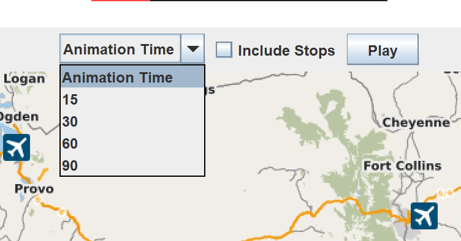

# Java GUI Map Animation Project

## Overview
This project is a Java-based GUI application that visualizes trip data on an interactive map using the JMapViewer library. The application animates a path based on provided trip points, with dynamic functionality for user customization such as animation speed and inclusion of stops.

## Features
- **Interactive Map**: Displays trip paths dynamically on a visually engaging map.
- **Customizable Animation**:
  - Select animation speed (15, 30, 60, or 90 seconds).
  - Option to include or exclude stops using a checkbox.
- **Dynamic Path Tracking**:
  - Animates the path with a raccoon icon representing the current position.
  - Draws a trail behind the raccoon to show the completed path.
- **Centered Display**: Automatically centers the map to the trip area for optimal visibility.
- **Reset Functionality**: Clears previous animations for a fresh start.

## Components
1. **JComboBox**: Allows users to select animation time.
2. **JCheckBox**: Toggles the inclusion of stops in the animation.
3. **JButton**: Starts or resets the animation.
4. **Map Viewer**: Visualizes the trip path and animates the raccoon icon.

## Technologies Used
- **Java SE 8+**: For building the application.
- **JMapViewer Library**: For rendering the map and map-related functionality.
- **Custom Java Classes**:
  - `TripPoint.class`: Handles trip point data.
  - `IconMarker.class`: Adds the raccoon icon as a map marker.
  - `Driver.class`: Manages the program flow and animation logic.

## How It Works
1. **Data Input**: Reads trip data from a CSV file (`triplog.csv`) containing geographical coordinates.
2. **Animation**:
   - Raccoon icon animates along the path based on the selected speed.
   - Trail is dynamically drawn to represent the traveled path.
3. **User Interaction**:
   - Animation speed can be adjusted using the drop-down menu.
   - Stops can be included/excluded using the checkbox.
   - Play button starts or resets the animation.

## Installation
1. Clone the repository or download the source files.
2. Ensure Java SE 8+ is installed on your machine.
3. Add the JMapViewer JAR file to your project library.
4. Compile and run `Driver.class`.

## Usage
1. Launch the application.
2. Select the desired animation time from the drop-down menu.
3. Check or uncheck the "Include Stops" checkbox based on your preference.
4. Click the **Play** button to start the animation.
5. To reset, click the **Play** button again.

## Example Outputs
### GUI with Controls

### Animation Example

## File Structure
- `Driver.class`: Main program file controlling the application flow.
- `TripPoint.class`: Handles trip point data parsing and logic.
- `IconMarker.class`: Creates raccoon icon markers on the map.
- `triplog.csv`: Dataset containing trip points.
- `raccoon.png`: Image used for the raccoon icon.
- `README.md`: Documentation file.

## Future Improvements
- Add support for importing additional datasets.
- Implement real-time trip data updates.
- Enhance visualization with custom map themes.

## Author
Your Name  
Email: kairugakuo9@gmail.com  
GitHub: (https://github.com/kairugakuo2)

## License
This project is licensed under the MIT License. See `LICENSE` for details.

